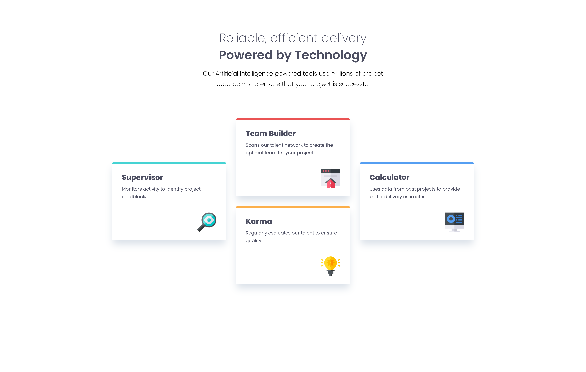
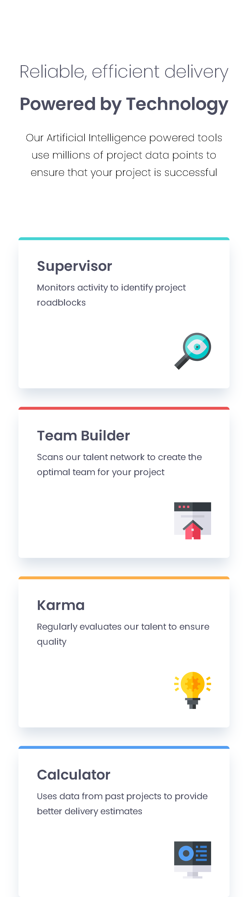

# Four Card Feature Section Solution

This is my solution to the [Four Card Feature Section challenge](https://www.frontendmentor.io/challenges/four-card-feature-section-weK1eFYK) on Frontend Mentor. The task was to build a responsive four-card feature section using HTML and CSS.


## Table of Contents

- [Overview](#overview)
  - [The Challenge](#the-challenge)
  - [Screenshot](#screenshot)
  - [Links](#links)
- [My Process](#my-process)
  - [Built With](#built-with)
  - [What I Learned](#what-i-learned)
  - [Continued Development](#continued-development)
  - [Useful Resources](#useful-resources)
- [Author](#author)

## Overview

### The Challenge

Users should be able to:

- View the optimal layout for the site depending on their device's screen size.
- See hover states for all interactive elements on the page.

### Screenshot

#### Desktop



#### Mobile



### Links

- Solution URL: [GitHub Repository](https://github.com/OmarElprolosy66/four-card-feature-section-master)
- Live Site URL: [GitHub Pages](https://omarelprolosy66.github.io/four-card-feature-section-master/)

## My Process

### Built With

- Semantic HTML5 markup
- CSS custom properties
- Flexbox
- CSS Grid
- Mobile-first workflow

### What I Learned

Through this challenge, I improved my understanding of CSS Grid and Flexbox, which are crucial for creating responsive layouts. Here's a snippet of code I'm proud of:

```css
.hero-sec {
  display: grid;
  grid-template-columns: repeat(3, 1fr);
  grid-template-rows: repeat(4, 1fr);
  grid-gap: 2rem;
}
```

This grid layout allowed me to create a responsive layout where each card is perfectly aligned and scales well on different screen sizes.

### Continued Development

In future projects, I want to focus more on:

- Improving accessibility by ensuring all HTML elements are semantic and well-structured.
- Experimenting with CSS animations and transitions to add subtle visual cues.

### Useful Resources

- [CSS Tricks - A Complete Guide to Grid](https://css-tricks.com/snippets/css/complete-guide-grid/) - This resource helped me understand CSS Grid better and implement it effectively in this project.
- [MDN Web Docs - Flexbox](https://developer.mozilla.org/en-US/docs/Web/CSS/CSS_Flexible_Box_Layout/Basic_Concepts_of_Flexbox) - A comprehensive guide to understanding Flexbox.

## Author

- GitHub - [OmarElprolosy66](https://github.com/OmarElprolosy66)
- Frontend Mentor - [@OmarElprolosy66](https://www.frontendmentor.io/profile/OmarElprolosy66)
